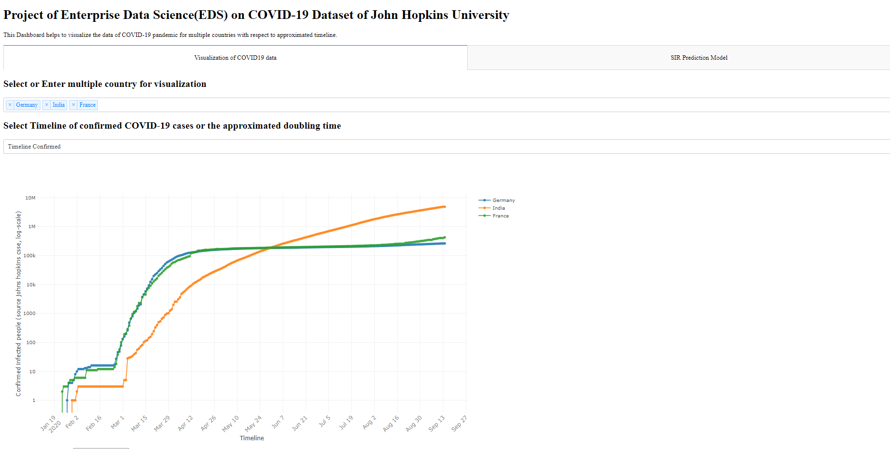
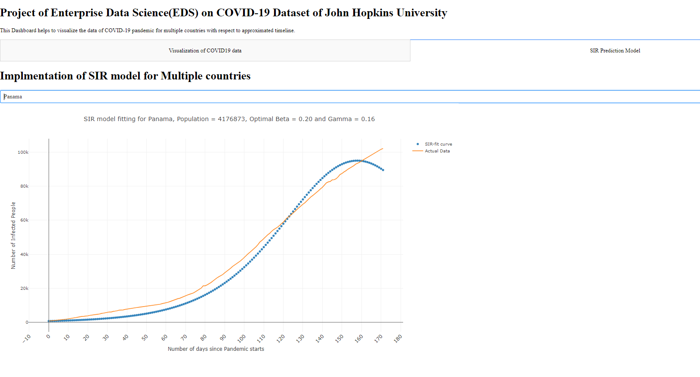

Video is uploaded to the OLAT.

**Goal:**
1) is to Visualize the Covid 19 Dataset for better understanding the epidemiological models.
2) determine the total number of infected and Doubling rate.
3) SIR model simulation for more than 100 countries.
4) One click run.

This project is done in Python. I have used Dash Library for Visualisation. Make sure to install Dash on your PC.
Main File is visualize.py which contains all the code required for visualisation. 
Visualize_SIR.py contains code for SIR modeling but you have to run only visualize.py for overall visualisation.

Dashboard contains two tabs 1st tab contains the visualisation of covid 19 dataset for multiple countries along with doubling rate whereas 2nd tab contains SIR prediction model.

**Dashboard**

**SIR Model**
S: Susceptible, I: Infected, R: Recovered An SIR model is an epidemiological model that computes the theoretical number of people infected with a contagious illness in a closed population over time.

